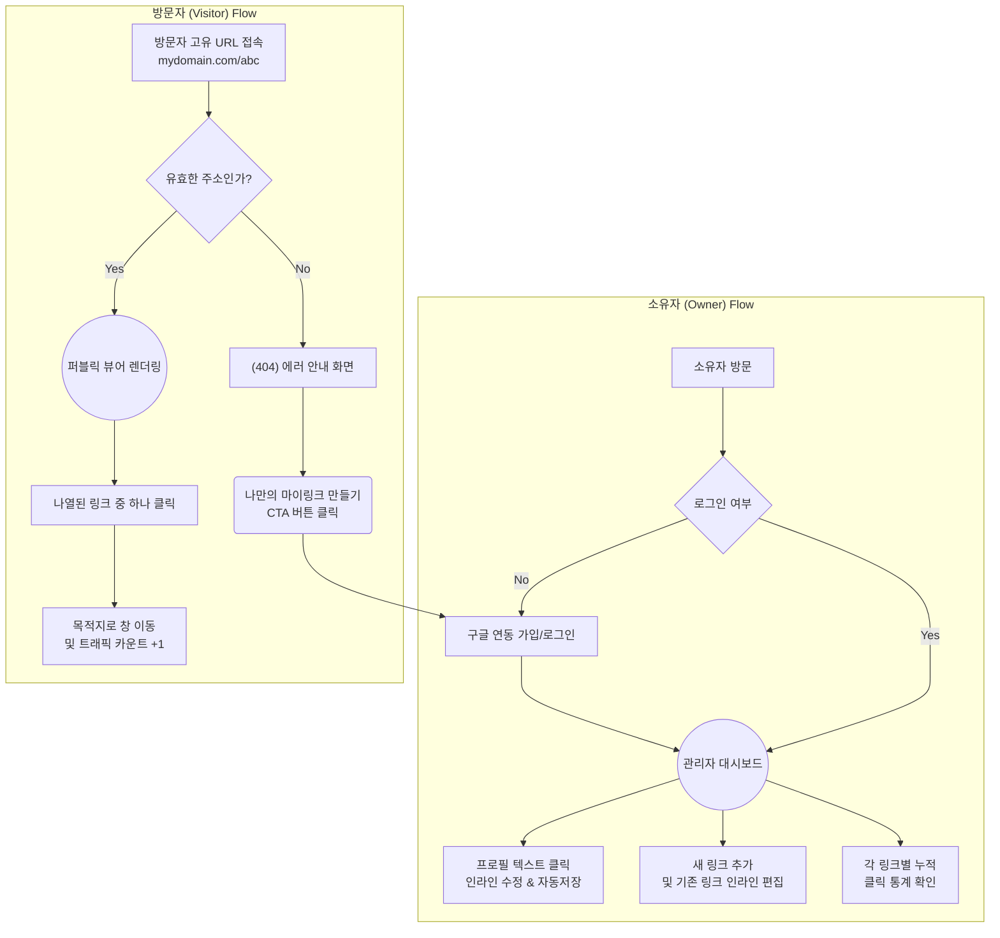

# 마이링크 (MyLink) - 화면 설계 및 와이어프레임 (Wireframe)

본 문서는 마이링크의 핵심 화면 레이아웃(아스키 아트) 및 사용자 흐름에 대한 다이어그램(Mermaid)을 정의한 마크다운 문서입니다.

---

## 1. 사용자 흐름도 (User Flow)

마이링크 서비스 내에서 소유자(Owner)와 방문자(Visitor)가 각각 어떻게 목적을 달성하는지 표현한 흐름도입니다.



---

## 2. 화면 와이어프레임 (ASCII Art)

모바일 디바이스에 최적화된 마이링크의 인터페이스를 직관적인 아스키 아트로 설계했습니다.

### 🧩 2.1 퍼블릭 뷰어 화면 (방문자 시점)
- 사용자가 접속할 외부 페이지 (`mydomain.com/[displayName]`) 레이아웃입니다.
- 불필요한 테마나 이미지가 없는 **심플한 텍스트 & 버튼 중심 UI**로 구현합니다.

```text
+-----------------------------------------+
|                                         |
|                 [ 👤 ]                  |  <-- 아바타 아이콘 (업로드 없음)
|                                         |
|         @displayName (고유 슬러그)      |  <-- URL에 사용된 닉네임 (Bold)
|              홍길동 (username)          |  <-- 화면에 노출될 실제 유저 이름
|                                         |
|         "여기에 포커스 아웃으로 자동    |  <-- 한 줄 소개글 (Bio)
|          저장된 소개글이 노출됩니다."   |
|                                         |
+-----------------------------------------+
|                                         |
|     [ 🌐 나의 기술 블로그          ]    |  <-- 구글 파비콘 API 로고 + 링크 제목
|                                         |
|     [ 📷 인스타그램 포트폴리오     ]    |
|                                         |
|     [ 💼 링크드인 프로필 방문      ]    |
|                                         |
|     [ 💻 깃허브 오픈소스 저장소    ]    |
|                                         |
+-----------------------------------------+
|                                         |
|         Create your MyLink 🚀           |  <-- 서비스 브랜딩 (CTA 역할 겸용)
|                                         |
+-----------------------------------------+
```

<br/>

### 🧩 2.2 권리자 대시보드 화면 (소유자 시점)
- 서비스에 로그인하여 프로필과 링크를 관리하는 시스템 내부 화면입니다.
- 인라인 편집, 순서 변경 드래그 핸들, 토글 및 클릭 통계 등 필수 정보가 집약되어 있습니다.

```text
+-------------------------------------------------+
| MyLink Admin                  [내 페이지 보기]  |
+-------------------------------------------------+
| [프로필 설정] (텍스트를 클릭해 바로 수정하세요) |
|                                                 |
|  *URL 슬러그 : [ abc                 ] ✏️     |  <-- 인라인 에디트 (Enter시 저장)
|  *표시 이름  : [ 홍길동              ] ✏️     |
|  *소개글(Bio): [ 안녕하세요 방문해.. ] ✏️     |
|                                                 |
|  +-------------------------------------------+  |
|  |           [ + 새로운 링크 추가 ]          |  |
|  +-------------------------------------------+  |
|                                                 |
| [내 링크 목록]                                  |
+-------------------------------------------------+
|  =  | 🌐 |  [ 나의 기술 블로그    ] ✏️        |  <-- '=' 기호는 드래그 핸들
|     |    |  [ https://blog.t...   ] ✏️        |
|     |    |                                      |
|     |    |  상태: (On/Off 토글) | 클릭수: 26 👆 |  <-- 1분당 1개만 카운트된 통계
|     |    |                          [삭제 🗑️]   |
+-------------------------------------------------+
|  =  | 📷 |  [ 인스타그램 포트폴리오] ✏️        |
|     |    |  [ https://inst...       ] ✏️        |
|     |    |                                      |
|     |    |  상태: (On/Off 토글) | 클릭수: 15 👆 |
|     |    |                          [삭제 🗑️]   |
+-------------------------------------------------+
```

> **📌 주요 참고 사항**
> - **인라인 편집 (✏️)**: 폼 이동 없이, 텍스트가 위치한 박스를 누르면 바로 수정 모드(`input` 태그 활성화)로 바뀌며 바깥 영역을 누르면 저장됩니다.
> - **드래그 앤 드롭 (`=`)**: 모바일 및 PC 환경에서 리스트 좌측 라인을 꾹 누른 채 상하로 옮기면 인덱스 번호가 즉각 바뀌며 저장됩니다.
> - **파비콘 아이콘 (`🌐`, `📷`)**: 이미지 업로드 없이 사용자가 입력한 URL을 기준으로 구글 API가 알아서 찾아 그려줍니다.
